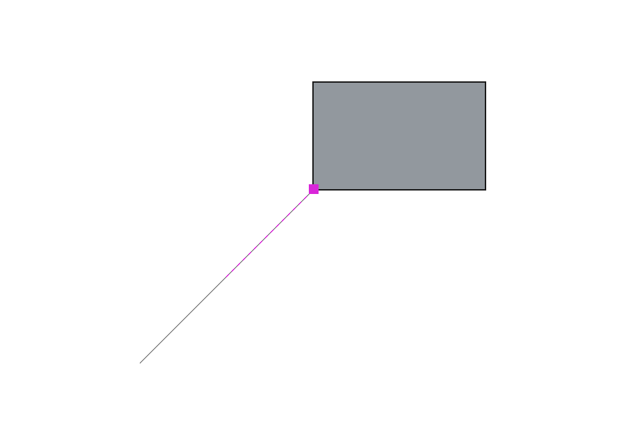

# SketchLayer for FreeCAD

SketchUp-style inline drawing for FreeCAD: draw a **line/polyline**,
**rectangle**, **circle**, **regular polygon** or **3-point arc** directly in
the 3D view, on the working plane or a selected planar face, with
SketchUp-style **colored inference cues** and inline **type-to-dimension**.
Close a loop and you get a lightweight planar face, ready to extrude with the
companion **PushPull** addon.

## Why

FreeCAD's built-in **Draft** workbench already has a strong, SketchUp-inspired
snapping engine (endpoint, midpoint, perpendicular, parallel, intersection,
extension, on-axis, and more) and can draw on a model face. What it does *not*
have is the part of SketchUp that makes drawing feel effortless: **colored,
categorized on-screen inference feedback**, a **floating value box** you type
into as you draw, and an immediate **loose face** you can push/pull. SketchLayer
adds exactly that thin perception/UX layer on top of FreeCAD's own geometry - 
it does **not** reimplement Draft's snapping.

## What it does

- **Colored inference HUD.** As you move the cursor, SketchLayer shows a
  colored cue for the strongest inference relative to what you're drawing:
  - **red**: aligned to the working plane's first axis ("on red axis"),
  - **green**: aligned to the second axis ("on green axis"),
  - **magenta**: parallel or perpendicular to the segment you just drew,
  - **green dot**: on an existing path point (so you can close the loop),
  - **cyan dot**: on the midpoint of a segment (of the path so far, or of a
    straight edge of existing model geometry),
  - **blue dot**: on the center of a circular edge of existing geometry.
  The inference also *locks the point onto that line*, so a near-aligned
  cursor snaps exactly onto the axis/parallel, like SketchUp.
- **Arrow-key axis lock.** While drawing, the arrow keys lock the direction
  the way SketchUp does: Right or Left locks the red (U) axis, Up or Down
  locks the green (V) axis, through the last placed point. The cursor then
  projects onto that axis wherever you move, the HUD shows the locked-axis
  guide, and a typed length commits the exact distance along the locked
  axis. Press the same key again (or the other axis' key) to unlock or
  switch.
- **Type-to-dimension (floating value box).** Start a segment and type a
  length, or `W,H` for a rectangle, then press Enter: the exact dimension is
  applied. No focus change, no dialog.
- **Draw on a face.** Select a planar face before starting and SketchLayer
  aligns the drawing plane to it; otherwise it draws on the global XY plane.
- **Makes a Push/Pull-ready face.** Closing a rectangle or polyline creates a
  standalone planar `Part` face - exactly the input the companion
  [PushPull](https://github.com/mathmati/FreeCAD-PushPull) addon extrudes into
  a solid. Draw a rectangle, then push it up: the SketchUp loop.
- **Circle and polygon tools.** Click the center, then drag or type an exact
  radius. Polygons default to 6 sides; type `8s` mid-tool and press Enter to
  switch to any count from 3 to 999, the way SketchUp does it. Both commit
  true planar faces through the same Push/Pull-ready path as the rectangle
  (the circle is a real `Part.makeCircle` face, not a polyline approximation;
  the live preview band is, but that is display only).
- **3-point arc tool.** Click the start, a second point on the curve, then
  the end. It commits an open arc edge, not a face: same as SketchUp, a lone
  arc cannot be pushed/pulled until other edges close it into a loop.
  Collinear picks are refused with a status message and the tool stays alive.
- **Reuses Draft's snapper.** For snaps to *existing model geometry*,
  SketchLayer consults FreeCAD's own `Snapper` (with its monochrome glyph
  suppressed so only the colored HUD shows); the deterministic
  ray/plane intersection is the fallback.

## Quick start

1. Open (or create) a document. Optionally select a planar face to draw on.
2. Activate the **SketchLayer** workbench and pick **Line**, **Rectangle**,
   **Circle**, **Polygon** or **Arc**.
3. Click points in the 3D view. Watch the colored cues; type a length, a
   radius or `W,H` for exact sizes (`8s` for polygon sides). Use the arrow
   keys to lock the red/green axis while you place. Close the loop
   (click the start point, or press Enter).
4. A planar face appears. Switch to **Push/Pull** and drag it into a solid.

Esc cancels at any time, leaving the document unchanged.

## SketchUI integration (optional)

When the companion SketchUI umbrella workbench is installed, starting a
draw tool checks its toolbar button (the pressed look of the active tool),
and finishing or cancelling clears it. The hook is three guarded calls into
`freecad.SketchUIWB.toolstate`, made where the draw session starts and
where it tears down. When SketchUI is not installed (or fails to import)
every call is a no-op and SketchLayer behaves exactly as before: the
regression suite simulates a blocked import and asserts that.

## Scope (v1) and honest limitations

- **Tools:** Line/polyline, Rectangle, Circle, regular Polygon and 3-point
  Arc. (Offset and freehand drawing are future work.)
- **Arc output is an edge, not a face.** A committed arc is a single open
  arc-of-circle edge inside a `Part::Feature`; it cannot be extruded until
  you close it with other edges. This matches SketchUp.
- **Polygon sides are typed only mid-tool.** There is no task-panel field or
  preference for the side count; `8s` + Enter while the tool runs is the only
  way to change it (default 6, range 3-999).
- **Drawing plane:** a selected planar face, or the global XY plane. It does
  not yet follow the *hovered* face automatically, nor use an arbitrary Draft
  working plane - pick the face first.
- **Draw-on-face does not split the B-rep.** Like Draft (and unlike SketchUp),
  drawing on an existing face produces an independent face on that plane; it
  does not subdivide the underlying solid's face. That behavior is the biggest
  remaining SketchUp gap and is deliberately out of v1 scope.
- **Object snapping** to model geometry is best-effort via Draft's `Snapper`;
  the drawing-relative inference (axis/parallel/perpendicular/endpoint) plus
  the midpoint/center snap is the part SketchLayer implements and verifies
  itself.
- **Inference categories:** on-axis (U/V), parallel, perpendicular,
  path-endpoint, midpoint and center. Priority is endpoint > midpoint/center
  > axis > parallel/perpendicular > free. Midpoint/center sources are the
  in-progress path's segments plus the straight edges (midpoints) and
  circular edges (centers) of existing `Part::Feature` shapes, collected
  once when the tool starts. There is no face-center snap, no tangent
  inference, and no multi-inference arbitration.
- **Axis lock is absolute.** While an arrow-key lock holds, the lock wins
  over every other inference (endpoint, midpoint, parallel), same as
  SketchUp's forced direction. Unlock to get the normal arbitration back.
  While a draw tool runs, bare letter keys and Space are reserved for the
  tool: the key filter swallows them so application accelerators (such as
  the SketchUI single-letter shortcuts) cannot fire mid-draw. `x` and `s`
  still reach the typed buffer.

## Screenshots

Colored inference captured live from a real FreeCAD 1.1 3D view (looking down
at the XY plane):

| Green V-axis (perpendicular) | Red U-axis | Magenta parallel | Committed face |
|---|---|---|---|
|  |  |  |  |

## Verification

Checked against a real FreeCAD 1.1 install: the workbench and its commands
auto-register with zero Report-View errors (verified for Line and Rectangle
with the GUI driver in `verify/drivers/`; the three new commands go through
the same `register()` path and the driver asserts them too, but it was not
re-run for this change); the colored inference HUD renders the **correct
color per category** (verified at the pixel level: red/green/magenta); a
closed rectangle commits a single planar face of the expected area; and a
headless (`freecadcmd`) regression exercises the
inference resolver, face builder, and the full draw state machine including
typed dimensions and the coplanarity guard. The regression also covers the
new tools: circle by drag and by typed radius (exact radius, area pi r^2),
default and typed-sides polygons (exact regular areas), arc center, radius,
on-curve point and length, collinear-arc refusal, cancel paths, and a
planarity check on every produced face. The same regression covers midpoint
and center snapping (path segments and document edges, the cyan/blue cues,
and the endpoint > midpoint > axis priority) and the arrow-key axis lock
(off-axis cursor projection onto U and V, toggle/unlock, and a typed length
committed exactly along the locked axis). It also covers the optional
SketchUI highlight hook: a no-op when `freecad.SketchUIWB` is not
importable (the import is blocked in the check, and the draw behavior is
asserted unchanged), and `mark_active`/`mark_inactive` firing through a
fake toolstate, plus a static xref of the hook call sites in commands.py.
50/50 checks pass. The live drawing
is driven through SketchLayer's Gui-decoupled `DrawController`, the same
object the mouse/keyboard callbacks drive.

## License

Code is MIT (see `LICENSE` and the SPDX headers).

## Transparency

Built with [Claude Code](https://claude.com/claude-code).
